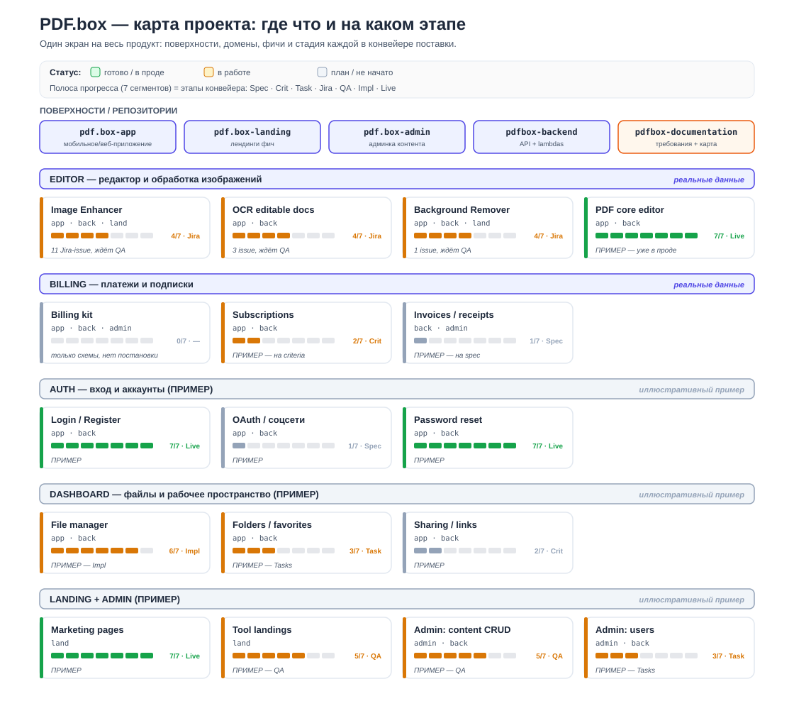

# PDF.box — карта проекта

Большой обзор всего продукта: поверхности (репозитории), домены, фичи и стадия каждой
в конвейере поставки. Это «зашёл и увидел, где что и на каком этапе».

> ⚠️ **Что реально, а что пример.** Этот репозиторий (`pdfbox-documentation`) знает только про
> свои домены — **editor** и **billing** помечены «реальные данные». Остальные домены
> (auth, dashboard, landing, admin) показаны как **иллюстративный пример** структуры, чтобы
> карта выглядела как карта всего продукта. Реальный статус по ним появится, когда их фичи
> заведут в конвейер здесь.

## Как читать

- **Поверхности** сверху — четыре продукта на одном бэкенде + этот репозиторий документации.
- **Полоса прогресса** у каждой фичи — 7 сегментов = этапы: `Spec · Crit · Task · Jira · QA · Impl · Live`.
  Закрашено столько, до какого этапа доведена фича. Цвет = статус (зелёный готово, оранжевый в работе, серый план).
- **Теги репозиториев** (`app · back · land · admin`) — каких поверхностей касается фича.

## Реальное состояние (из этого репозитория)

- **editor / Image Enhancer** — 4/7, доведён до Jira (11 issue), ждёт QA test cases.
- **editor / OCR editable docs** — 4/7, Jira (3 issue), ждёт QA.
- **editor / Background Remover** — 4/7, Jira (1 issue), ждёт QA.
- **billing / Billing kit** — 0/7, есть только схемы, постановки (feature-spec) ещё нет.

Детальный статус — в [SYSTEM-MAP.md](./SYSTEM-MAP.md) и [PROGRESS.md](./PROGRESS.md).
Как устроен сам конвейер — в [delivery-workflow-diagram.md](./delivery-workflow-diagram.md).

## Как обновлять

Карта — статический SVG, собранный из данных о фичах. Когда фича двигается по этапам:
поменяй её строку в [SYSTEM-MAP.md](./SYSTEM-MAP.md), затем перегенерируй `project-map.svg`
(тем же способом, что и остальные SVG — см. [шаблон визуала](../templates/feature-diagram.md)).
Это зона ответственности скилла-картографа `sa-cartographer`.
