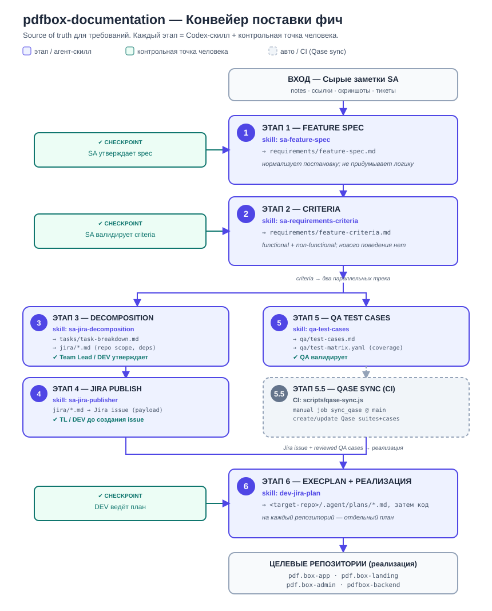
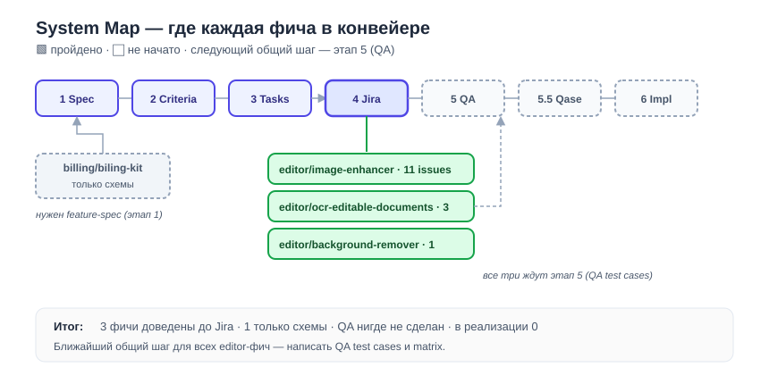

# 📘 Документация pdfbox — начни отсюда

Это **человеческий вход** в репозиторий. Если ты тут впервые — прочитай эту страницу, она
займёт минуту. Технические правила для AI-агентов лежат в [`AGENTS.md`](../../AGENTS.md).

## Что это за репозиторий

`pdfbox-documentation` — единый источник правды для **бизнес-требований** и **передачи фич в
разработку**. Здесь не пишут код. Здесь сырые заметки SA превращаются в проверяемую
постановку, разбиваются на задачи, доводятся до Jira и QA, и только потом уходят в целевые
репозитории (`pdf.box-app`, `pdf.box-landing`, `pdf.box-admin`, `pdfbox-backend`).

## Как устроен процесс (одна картинка)



Коротко: каждый этап делает свой Codex-скилл, а человек ставит контрольную точку (checkpoint).
Между этапами передаются только ссылки на артефакты — не вся история обсуждений.

## Где сейчас все фичи



Живой статус — в [SYSTEM-MAP.md](./SYSTEM-MAP.md) и [PROGRESS.md](./PROGRESS.md).

## Куда дальше

| Хочу… | Открой |
|---|---|
| Увидеть весь проект одной картинкой | [PROJECT-MAP.md](./PROJECT-MAP.md) |
| Понять весь процесс детально | [delivery-workflow-diagram.md](./delivery-workflow-diagram.md) |
| Увидеть все фичи и их этап | [SYSTEM-MAP.md](./SYSTEM-MAP.md) |
| Узнать, что в работе / заблокировано | [PROGRESS.md](./PROGRESS.md) |
| Прочитать постановку конкретной фичи | `<domain>/<feature>/requirements/feature-spec.md` |
| Сделать схему для своей фичи | шаблон [../templates/feature-diagram.md](../templates/feature-diagram.md) |
| Правила работы агентов | [../../AGENTS.md](../../AGENTS.md) · [../process/ai-delivery-workflow.md](../process/ai-delivery-workflow.md) |

## Структура папки фичи

```
sa/docs/<domain>/<feature>/
├── requirements/   feature-spec.md · feature-criteria.md
├── tasks/          task-breakdown.md
├── jira/           *.md  (Jira-ready issue specs)
├── qa/             test-cases.md · test-matrix.yaml
└── diagrams/       overview.md (визуальный TL;DR фичи)
```

## Текущие фичи

- **editor / image-enhancer** — улучшение качества изображений (Standard/HD, 2x/4x). [Схема](./editor/image-enhancer/diagrams/overview.md) · [Spec](./editor/image-enhancer/requirements/feature-spec.md)
- **editor / ocr-editable-documents** — редактируемый OCR выбранной области страницы. [Схема](./editor/ocr-editable-documents/diagrams/overview.md) · [Spec](./editor/ocr-editable-documents/requirements/feature-spec.md)
- **editor / background-remover** — удаление фона с изображения. [Схема](./editor/background-remover/diagrams/overview.md) · [Spec](./editor/background-remover/requirements/feature-spec.md)
- **billing / biling-kit** — биллинг (пока только схемы flow/action, постановки нет).
- **gozap / partners-admin** — админка для партнёров: создание партнёра, привязка станций с % комиссии, кабинет с балансом, выплаты через Stripe. [Схема](./gozap/partners-admin/diagrams/overview.md) · [Spec](./gozap/partners-admin/requirements/feature-spec.md)
- **gozap / terminal-rental-app** — приложение станции: основной поток (номер + SMS + карта + выдача powerbank) и упрощённый поток для разряженного телефона. [Схема](./gozap/terminal-rental-app/diagrams/overview.md) · [Spec](./gozap/terminal-rental-app/requirements/feature-spec.md)
- **gozap / admin-roles** — роли в админке: супер-админ создаёт админов с уровнями доступа. [Схема](./gozap/admin-roles/diagrams/overview.md) · [Spec](./gozap/admin-roles/requirements/feature-spec.md)
- **gozap / auth** — автоматическая вставка кода из SMS с ручным fallback и лимитом попыток. [Схема](./gozap/auth/diagrams/overview.md) · [Spec](./gozap/auth/requirements/feature-spec.md)

---

> SVG-схемы на этой странице сгенерированы из тех же данных, что и Mermaid в `SYSTEM-MAP.md`.
> Обновляешь карту — перегенерируй SVG (см. [шаблон визуала](../templates/feature-diagram.md)).
