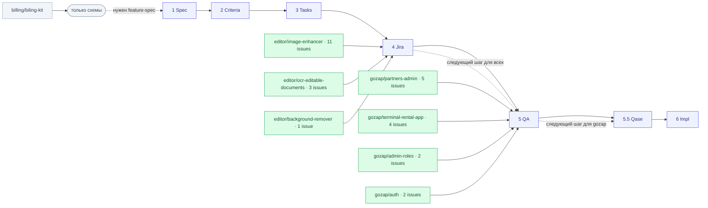

# System Map — pdfbox-documentation

Живая карта всех фич и их положения в конвейере поставки. **Эта таблица — канонический
источник**; Mermaid-схема ниже генерируется из неё. Чтобы поменять картинку — поменяй
таблицу, затем перерисуй диаграмму.

Конвейер этапов (см. [delivery-workflow-diagram.md](./delivery-workflow-diagram.md)):
`1 Spec → 2 Criteria → 3 Tasks → 4 Jira → 5 QA → (5.5 Qase) → 6 Impl`

**Легенда статуса:** 🟩 `done` (этап пройден) · 🟨 `in-progress` · ⬜ `planned` / нет артефакта · 🟥 `blocked`

**Tally:** фич всего 8 · доведено до Jira 3 · только схемы 1 · с QA test cases 4 · в реализации 0

---

## Реестр фич (канонично)

| Домен | Фича | 1 Spec | 2 Criteria | 3 Tasks | 4 Jira | 5 QA | 6 Impl | Текущий этап | Заметки |
|---|---|:---:|:---:|:---:|:---:|:---:|:---:|---|---|
| editor | image-enhancer | 🟩 | 🟩 | 🟩 | 🟩 | ⬜ | ⬜ | **Jira-ready** | Самая зрелая: 11 Jira-issue (pipeline PicWish, lambdas preview/convert, guest→workspace, cleanup/retention). Ждёт QA test cases. |
| editor | ocr-editable-documents | 🟩 | 🟩 | 🟩 | 🟩 | ⬜ | ⬜ | **Jira-ready** | 3 issue: 2 backend (bootstrap OCR-области, background cleaning + Gemini) + 1 frontend (edit OCR flow). Ждёт QA. |
| editor | background-remover | 🟩 | 🟩 | 🟩 | 🟩 | ⬜ | ⬜ | **Jira-ready** | 1 issue: end-to-end backend pipeline. Ждёт QA. |
| billing | biling-kit | ⬜ | ⬜ | ⬜ | ⬜ | ⬜ | ⬜ | **Diagrams-only** | Есть только Mermaid-схемы (flow1, action1, action2). Постановки/criteria ещё нет — нужно начать с feature-spec. |
| gozap | partners-admin | 🟩 | 🟩 | 🟩 | 🟩 | 🟩 | ⬜ | **QA test cases готовы** | 5 Jira-issue (партнёры, привязка станций, баланс, Stripe payout, UI). 6 TC. Ждёт Qase sync + ручной QA review. |
| gozap | terminal-rental-app | 🟩 | 🟩 | 🟩 | 🟩 | 🟩 | ⬜ | **QA test cases готовы** | 4 Jira-issue (account+card, payment+dispense, main flow UI, low-battery UI). 5 TC, 1 coverage gap (TC-005). Ждёт Qase sync. |
| gozap | admin-roles | 🟩 | 🟩 | 🟩 | 🟩 | 🟩 | ⬜ | **QA test cases готовы** | 2 Jira-issue (access levels model, create-admin + nav). 3 TC. Ждёт Qase sync. |
| gozap | auth | 🟩 | 🟩 | 🟩 | 🟩 | 🟩 | ⬜ | **QA test cases готовы** | 2 Jira-issue (SMS OTP service, autofill input). 3 TC. Общая зависимость для partners-admin и terminal-rental-app. Ждёт Qase sync. |

> Колонка «этап» = самый дальний пройденный этап. Следующий шаг для всех editor-фич — **этап 5 (QA test cases)**. Для всех gozap-фич — **этап 5.5 (Qase sync, требует ручного QA review)**.

---

## Карта (генерируется из таблицы)

---

## Как обновлять

1. Закрыл этап для фичи — поменяй её ячейку в таблице (⬜ → 🟩) и колонку «Текущий этап».
2. Обнови **Tally** вверху.
3. Если добавилась новая фича — добавь строку и узел в Mermaid (`:::done` / `:::planned`).
4. Зафиксируй изменение в [PROGRESS.md](./PROGRESS.md) (update log).

Владелец карты: кто ведёт фичу через конвейер (SA / Team Lead). Желательно закрепить за
отдельной ролью-картографом, чтобы карта не протухала (см. практику проекта personality_development).
