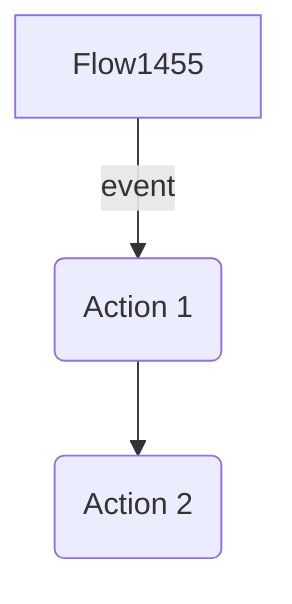

## flow1

```mermaid
flowchart TD 
    A[Flow1455] -->|event| Action1(Action 1)
    click Action1 "/-/blob/main/sa/docs/billing/biling-kit/actions/action1.md" "Open Action 1"

    Action1 --> Action2(Action 2)
    click Action2 "/-/blob/main/sa/docs/billing/biling-kit/actions/action2.md" "Open Action 2"
```
