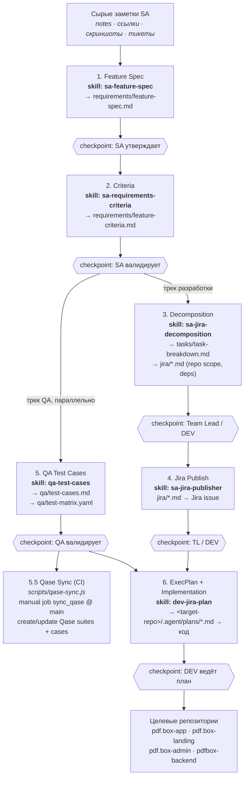
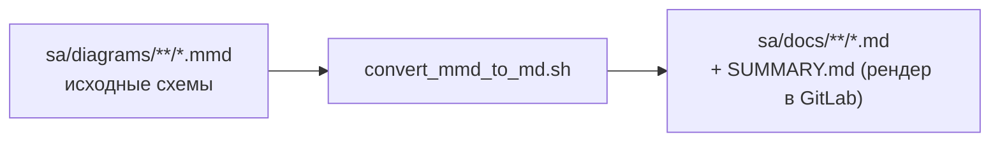

## Delivery Workflow Diagram

Схема процесса поставки фич в `pdfbox-documentation`: от сырых заметок SA до реализации
в целевых репозиториях. Каждый этап = Codex-скилл + human checkpoint. Между этапами
передаётся только handoff-контракт (ссылки на артефакты), а не вся история обсуждений.

Источники: `AGENTS.md`, `sa/README.md`, `sa/process/ai-delivery-workflow.md`,
`sa/process/qase-sync.md`, `.codex/skills/*`.

### Вспомогательный конвейер схем

Mermaid-исходники из `sa/diagrams/` конвертируются в рендеримые `.md` и индекс `SUMMARY.md`.

### Handoff-контракт между этапами

Передаются только ссылки: путь к feature spec, к criteria, к task breakdown,
к QA test cases (если есть), Jira issue key / путь к Jira-ready spec, имя целевого репозитория.

Ключевые правила: агент не создаёт Jira-задачи из сырых заметок, не публикует Qase без
ручного QA-review, не смешивает бизнес-требования с implementation-решениями и не
додумывает недостающую бизнес-логику.
