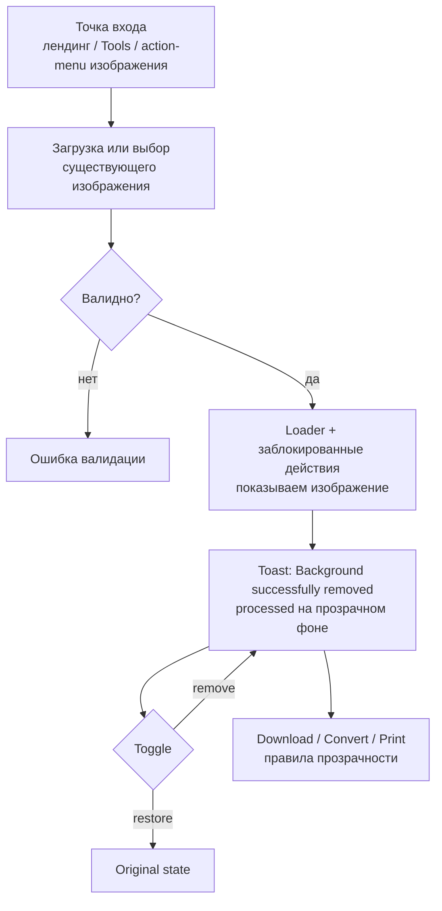
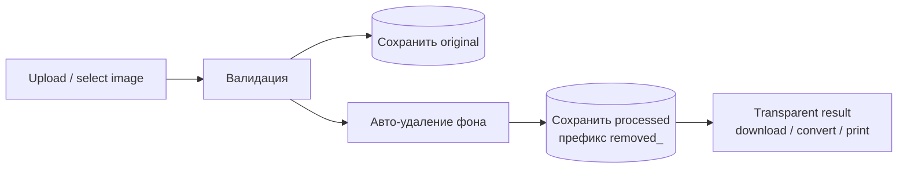

## Background Remover — визуальный TL;DR

Источник: [../requirements/feature-spec.md](../requirements/feature-spec.md). Схема — краткая суть, детали в спеке.

### User flow (что видит пользователь)

### Что внутри (pipeline)

> Этап в конвейере: **Jira-ready** (1 issue — end-to-end pipeline). Дальше — QA test cases. См. [../../../PROGRESS.md](../../../PROGRESS.md).
>
> Вне итерации: ручная маска, настройка fallback-цвета фона, batch, редактирование результата.
