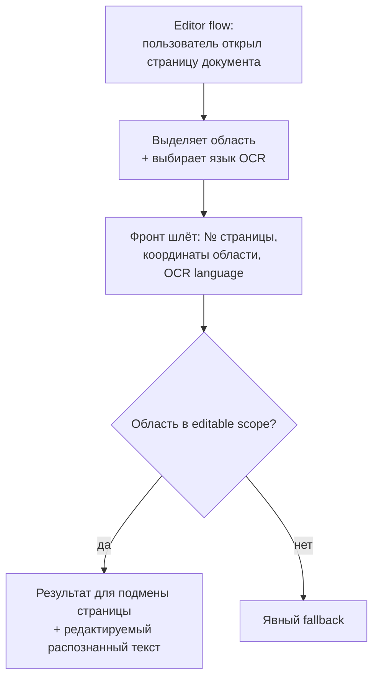
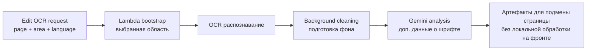

## Editable OCR Documents — визуальный TL;DR

Источник: [../requirements/feature-spec.md](../requirements/feature-spec.md). Схема — краткая суть, детали в спеке.

### User flow (что видит пользователь)

### Что внутри (pipeline)

> Этап в конвейере: **Jira-ready** (2 backend + 1 frontend issue). Дальше — QA test cases. См. [../../../PROGRESS.md](../../../PROGRESS.md).
>
> Вне итерации: 1:1 совпадение с оригиналом, превращение всех элементов в редактируемые, вынос Gemini в отдельный jobs module.
