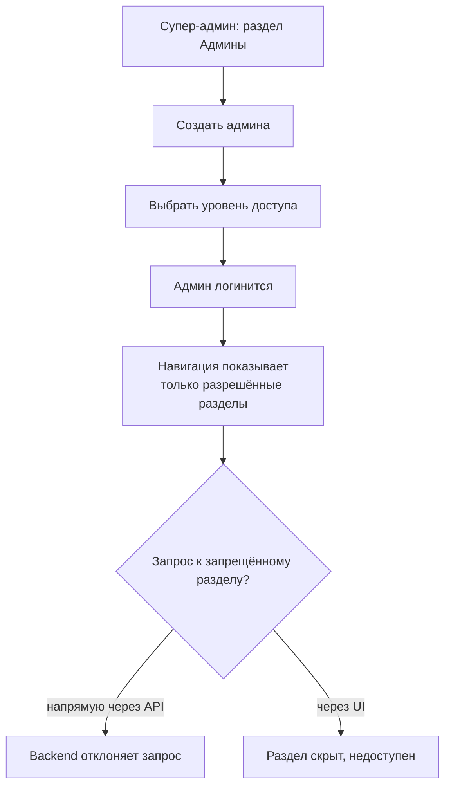
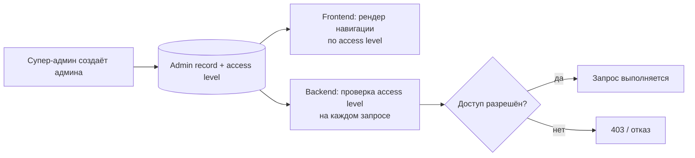

## Роли в админке — визуальный TL;DR

Источник: [../requirements/feature-spec.md](../requirements/feature-spec.md). Схема — краткая суть, детали в спеке.

### User flow (что видит пользователь)

### Что внутри (pipeline)

> Этап в конвейере: **QA test cases готовы**, ожидает ручного QA review и Qase sync. См. [../../../PROGRESS.md](../../../PROGRESS.md).
>
> Открытые вопросы: точное количество уровней доступа кроме супер-админ/админ; может ли быть больше одного супер-админа (см. feature-criteria.md).
