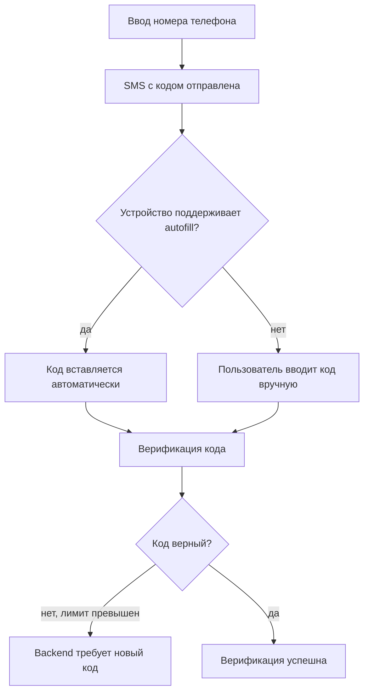
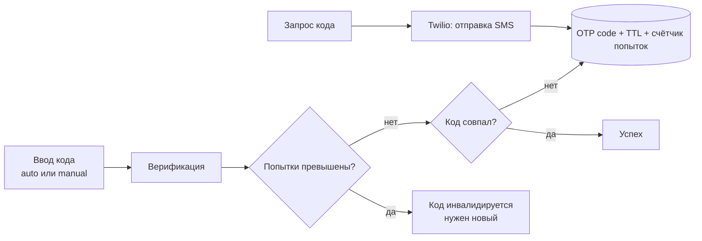

## Автоматическая вставка кода из SMS — визуальный TL;DR

Источник: [../requirements/feature-spec.md](../requirements/feature-spec.md). Схема — краткая суть, детали в спеке.

### User flow (что видит пользователь)

### Что внутри (pipeline)

> Этап в конвейере: **QA test cases готовы**, ожидает ручного QA review и Qase sync. См. [../../../PROGRESS.md](../../../PROGRESS.md).
>
> Открытые вопросы: точный срок жизни кода и максимальное число попыток ввода; поддержка нативного SMS autofill на целевой платформе (см. feature-criteria.md).
