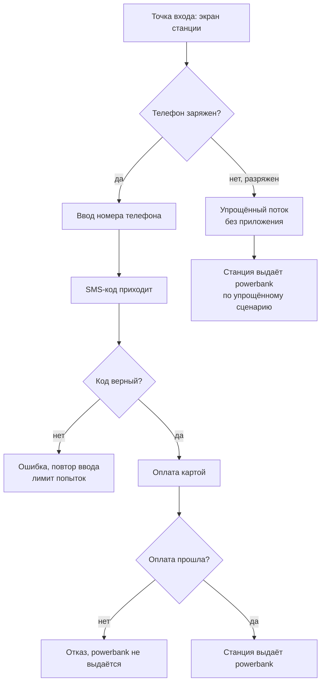
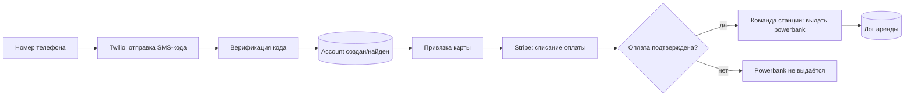

## Приложение станций для оплаты через терминал — визуальный TL;DR

Источник: [../requirements/feature-spec.md](../requirements/feature-spec.md). Схема — краткая суть, детали в спеке.

### User flow (что видит пользователь)

### Что внутри (pipeline)

> Этап в конвейере: **QA test cases готовы**, ожидает ручного QA review и Qase sync. См. [../../../PROGRESS.md](../../../PROGRESS.md).
>
> Coverage gap: сценарий "оплата прошла, но станция не выдала powerbank" — поведение не подтверждено SA (см. feature-criteria.md#open-questions).
