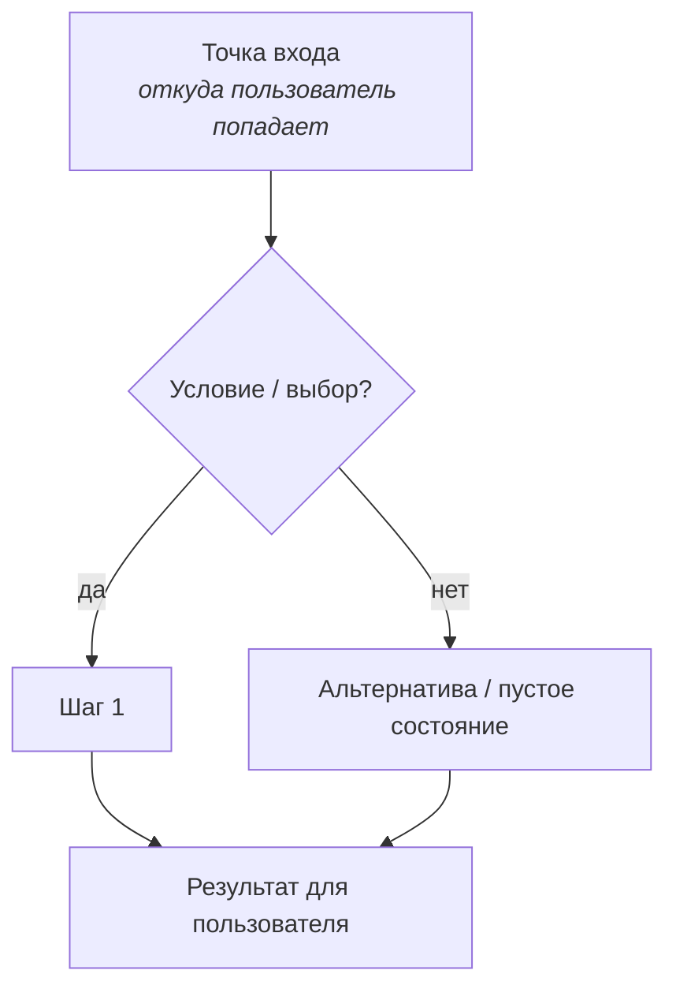
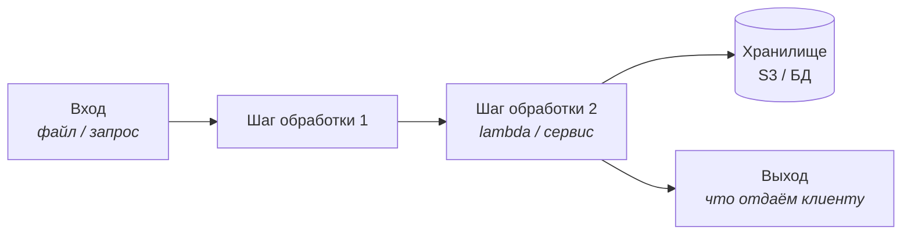
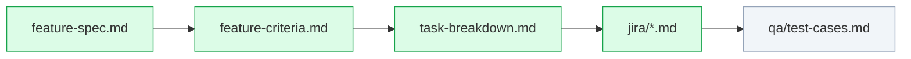

# Feature Diagram — шаблон визуала фичи

Назначение: **визуальный TL;DR фичи**, чтобы человек понял суть за минуту до чтения
feature-spec. Кладётся рядом с постановкой: `sa/docs/<domain>/<feature>/diagrams/overview.md`.

Правила:

- одна схема = один экран понимания; детали остаются в `requirements/feature-spec.md`
- подписи короткие (≤5 слов в блоке), без простыней
- 2 типа схем на выбор (или обе): **user flow** (что видит пользователь) и **data/pipeline flow** (что происходит внутри)
- держи схему в синхроне со спекой: меняется поведение → меняется схема

---

## 1. Шаблон: User Flow (что делает пользователь)



## 2. Шаблон: Data / Pipeline Flow (что внутри)



## 3. Мини-карта артефактов фичи (необязательно)

Показывает, какие документы у фичи уже есть и где она в конвейере.



---

## Как экспортировать в SVG (чтобы рендерилось без редактора)

Вариант A — Mermaid (рекомендуется, есть в репо-тулинге):

```bash
# единоразово
npm i -g @mermaid-js/mermaid-cli
# из блока ```mermaid в .md → .svg
mmdc -i sa/docs/<domain>/<feature>/diagrams/overview.md -o overview.svg
```

`.md` с блоком ` ```mermaid ` и так рендерится прямо в GitLab — отдельный SVG нужен только
для вставки в презентации/Confluence.

Вариант B — Excalidraw (для «рисованных» схем, как в personality_development/schemas):

1. нарисуй на [excalidraw.com](https://excalidraw.com), сохрани `diagrams/overview.excalidraw`
2. там же **Export → SVG**, положи рядом `diagrams/overview.svg`
3. оба файла коммить — `.excalidraw` для правок, `.svg` для просмотра

---

## Чек-лист перед коммитом

- [ ] схема отражает текущее поведение из feature-spec
- [ ] подписи короткие, без дублирования текста спеки
- [ ] есть SVG-экспорт (или Mermaid-блок, который рендерит GitLab)
- [ ] фича добавлена/обновлена в [../docs/SYSTEM-MAP.md](../docs/SYSTEM-MAP.md) и [../docs/PROGRESS.md](../docs/PROGRESS.md)
